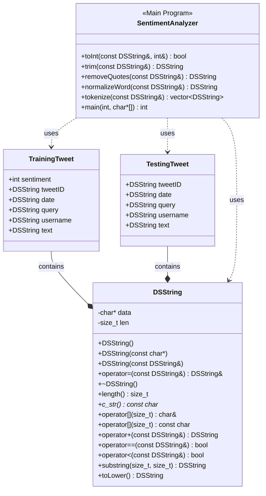

# Design documentation

```mermaid
classDiagram
    class DSString {
        -char* data
        -size_t len
        +DSString()
        +DSString(const char*)
        +DSString(const DSString&)
        +operator=(const DSString&) DSString&
        +~DSString()
        +length() size_t
        +c_str() const char*
        +operator[](size_t) char&
        +operator[](size_t) const char
        +operator+(const DSString&) DSString
        +operator==(const DSString&) bool
        +operator<(const DSString&) bool
        +substring(size_t, size_t) DSString
        +toLower() DSString
    }

    class TrainingTweet {
        +int sentiment
        +DSString tweetID
        +DSString date
        +DSString query
        +DSString username
        +DSString text
    }

    class TestingTweet {
        +DSString tweetID
        +DSString date
        +DSString query
        +DSString username
        +DSString text
    }

    class SentimentAnalyzer {
        <<Main Program>>
        +toInt(const DSString&, int&) bool
        +trim(const DSString&) DSString
        +removeQuotes(const DSString&) DSString
        +normalizeWord(const DSString&) DSString
        +tokenize(const DSString&) vector~DSString~
        +main(int, char*[]) int
    }

    TrainingTweet --* DSString : contains
    TestingTweet --* DSString : contains
    SentimentAnalyzer ..> TrainingTweet : uses
    SentimentAnalyzer ..> TestingTweet : uses
    SentimentAnalyzer ..> DSString : uses
```
