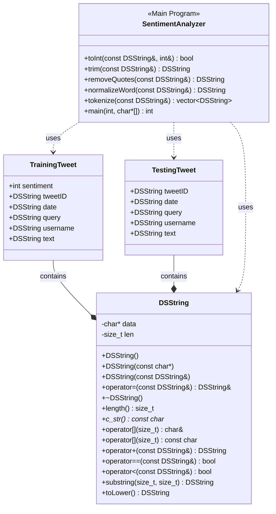

## Design Documentation
This program uses a simple lexicon-based approach to classify tweets as positive (sentiment value 4) or negative (sentiment value 0). It is trained on the tweets in train.csv, then tested on the tweets in test.csv, and finally the results are compared to the known sentiment values in test_ground.csv. The DSString class is a custom string class that provides memory management (allocation and deallocation), string manipulation operations (concatenation and substring extraction, comparison operations, case conversion, and C-string compatibility. The TrainingTweet class contains tweet ID, date, query, username, text and sentiment value. The TestingTweet class contains the same information, but without the sentiment value. Several helper functions help clean and process the text, including tokenizer which splits the text into individual words. There is also a custom hash function which allows for the use of DSString in an unordered map. In the main program, a lexicon dictionary is built based on the training data, where each word has a sentiment score. The score is incremented if the word appears in a positive tweet and decremented if the word appears in a negative tweet. Then, the test tweets are classified based on the sum of the scores of the words they contain. If the score is non-negative, the tweet is classified as positive, and if the score is negative, the tweet is classified as negative. Each prediction is output to a csv file. Then, predictions are evaluated against the ground truth, and the accuracy, as well as a list of misclassified tweets are output to a text file. 

## UML Diagram

## Questions

### How do you train the model and how do you classify a new tweet? Give a short description of the main steps.
A lexicon dictionary is built based on the training data, where each word has a sentiment score. The score is incremented if the word appears in a positive tweet and decremented if the word appears in a negative tweet. Then, the test tweets are classified based on the sum of the scores of the words they contain. If the score is less non-negative, the tweet is classified as positive, and if the score is negative, the tweet is classified as negative.

### How long did your code take for training and what is the time complexity of your training implementation (Big-Oh notation)? Remember that training includes reading the tweets, breaking it into words, counting, ... Explain why you get this complexity (e.g., what does N stand for and how do your data structures/algorithms affect the complexity).
The training only took a matter of seconds due to the simplicity of the algorithm. The time complexity of reading the training file is O(n) where n is the number of lines/tweets. The time complexity of tokenizing is O(w) per tweet, where w is the number of words. The time complexity of insertion into an unordered map O(1), so the total time complexity is O(n x w). 

### How long did your code take for classification and what is the time complexity of your classification implementation (Big-Oh notation)? Explain why.
Again, classification only took a few seconds because of the simplicity of the algorithm. The time complexity depends on the same variables as the training time complexity because the same operations are being performed. Lookup in an unordered map has the same time complexity as insertion into an unordered map (O(1)). Therefore the time complexity of testing is the same: O(n x w).

### What accuracy did your algorithm achieve on the provided training and test data?
My algorithm achieved 61.3% accuracy on the provided training and test data.

### What were the changes that you made that improved the accuracy the most?
Using lexicon logic improved my code the most because although it is simplistic, it meets the accuracy requirements and it runs very quickly, as opposed to other methods.

### How do you know that you use proper memory management? I.e., how do you know that you do not have a memory leak?
I know that I use proper memory management (avoid memory leaks) because the DSString class uses the rule of three. Specifically, a destructor frees the dynamically allocated char* data, a copy constructor allocates new memory and copies contents, and a copy assignment operator deletes old memory, allocates new space and copies new contents. The other data structures in the program (vector and unordered map) have automatic memory management.

### What was the most challenging part of the assignment?
The most challenging part of this assignment was implementing the DSString class. Since I have never created a custom data structure, there was a learning curve on how to integrate the custom DSString into the main program.

## Sources
1) https://chatgpt.com/c/67ba5084-4014-8001-b3ec-381ec8a3fa7e?model=o1
2) https://claude.ai/chat/4e6cd8d2-a82f-4a20-b51b-c1d1fe3ed052
3) https://www.cursor.com/en

I used ChatGPT to implement the DSString.cpp and sentiment.cpp programs, as well as debug build issues and learn about the time complexities. I used Cursor and Claude together to create a UML diagram in Mermaid. 

