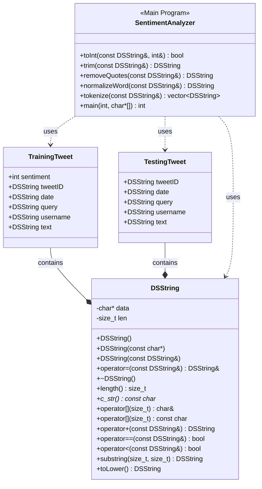

##Design Documentation
This program uses a simple lexicon-based approach to classify tweets as positive (sentiment value 4) or negative (sentiment value 0). It is trained on the tweets in train.csv, then tested on the tweets in test.csv, and finally the results are compared to the known sentiment values in test_ground.csv. The DSString class is a custom string class that provides memory management (allocation and deallocation), string manipulation operations (concatenation and substring extraction, comparison operations, case conversion, and C-string compatibility. The TrainingTweet class contains tweet ID, date, query, username, text and sentiment value. The TestingTweet class contains the same information, but without the sentiment value. Several helper functions help clean and process the text, including tokenizer which splits the text into individual words. There is also a custom hash function which allows for the use of DSString in an unordered map. In the main program, a lexicon dictionary is built based on the training data, where each word has a sentiment score. The score is incremented if the word appears in a positive tweet and decremented if the word appears in a negative tweet. Then, the test tweets are classified based on the sum of the scores of the words they contain. If the score is less non-negative, the tweet is classified as positive, and if the score is negative, the tweet is classified as negative. Each prediction is output to a csv file. Then, predictions are evaluated against the ground truth, and the accuracy, as well as a list of misclassified tweets are output to a text file. 

## Questions
How do you train the model and how do you classify a new tweet? Give a short description of the main steps.

Your answer

How long did your code take for training and what is the time complexity of your training implementation (Big-Oh notation)? Remember that training includes reading the tweets, breaking it into words, counting, ... Explain why you get this complexity (e.g., what does N stand for and how do your data structures/algorithms affect the complexity).

Your answer

How long did your code take for classification and what is the time complexity of your classification implementation (Big-Oh notation)? Explain why.

Your answer

What accuracy did your algorithm achieve on the provides training and test data?

My accuracy: xx%

The TA will run your code on Linux and that accuracy value will be used to determine your grade.

What were the changes that you made that improved the accuracy the most?

Your answer

How do you know that you use proper memory management? I.e., how do you know that you do not have a memory leak?

Your answer

What was the most challenging part of the assignment?

Your answer
