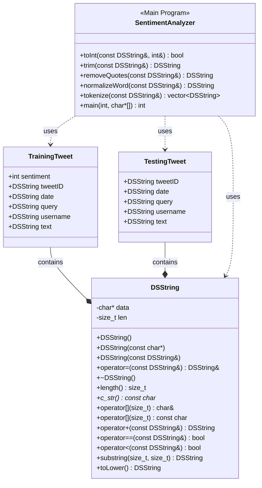

## Design Documentation

## Questions
How do you train the model and how do you classify a new tweet? Give a short description of the main steps.

Your answer

How long did your code take for training and what is the time complexity of your training implementation (Big-Oh notation)? Remember that training includes reading the tweets, breaking it into words, counting, ... Explain why you get this complexity (e.g., what does N stand for and how do your data structures/algorithms affect the complexity).

Your answer

How long did your code take for classification and what is the time complexity of your classification implementation (Big-Oh notation)? Explain why.

Your answer

What accuracy did your algorithm achieve on the provides training and test data?

My accuracy: xx%

The TA will run your code on Linux and that accuracy value will be used to determine your grade.

What were the changes that you made that improved the accuracy the most?

Your answer

How do you know that you use proper memory management? I.e., how do you know that you do not have a memory leak?

Your answer

What was the most challenging part of the assignment?

Your answer
